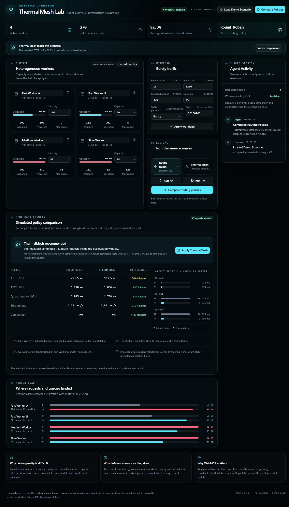

# ThermalMesh Lab

**Agent-Native AI Infrastructure Playground**

ThermalMesh Lab is a browser-based simulator for heterogeneous AI inference clusters. Configure workers with different abstract capacities, apply a reproducible workload, compare naive Round Robin routing with a simplified capacity/load-aware strategy, and let either a person or an AI agent operate the exact same application semantics through WebMCP.

> **Simulated metrics disclaimer:** ThermalMesh Lab uses a browser-based simulation. Results demonstrate routing behavior and are not hardware benchmarks.

## Demo screenshot



The captured dashboard shows the real demo preset after a WebMCP policy comparison, including calculated metrics, worker imbalance, the recommendation, and Agent Activity.

## The problem

Round Robin assumes every worker is interchangeable. In a heterogeneous inference cluster, equal request counts can drive a slow worker deep into queueing while faster workers remain underused. Tail latency rises even when the cluster still has useful aggregate capacity.

## The solution

ThermalMesh Lab makes that failure mode visible and reproducible:

1. Configure an ordered cluster of 1–12 abstract workers.
2. Set request rate, prompt size, expected output, duration, traffic shape, and seed.
3. Run either routing policy or compare both against the same seeded request trace.
4. Inspect simulated TTFT, queue latency, throughput, completion counts, utilization, and queue depth.
5. Apply the policy selected by a transparent scoring rule.

The included demo preset uses two fast workers, one medium worker, one worker four times slower than the fastest, and bursty traffic near aggregate saturation. The simulator—not a hard-coded result—determines the outcome.

## Why WebMCP instead of browser automation?

Infrastructure operations have semantics that are not reliably represented by coordinates, button text, or visual layout. An agent should ask the application to “compare routing policies,” not infer how to manipulate a chart by sight.

ThermalMesh Lab registers imperative site tools through `document.modelContext`. These tools call the same validated store actions as the visible React controls, so an agent update is immediately visible to the person sharing the page. Unsupported browsers still receive the complete manual simulator. The implementation follows the [official OpenAI Site tools documentation](https://learn.chatgpt.com/docs/webmcp) and the current [WebMCP draft](https://webmachinelearning.github.io/webmcp/).

## Exposed WebMCP tools

| Tool                          | Kind          | Purpose                                                                                                             |
| ----------------------------- | ------------- | ------------------------------------------------------------------------------------------------------------------- |
| `get_cluster_state`           | Read          | Inspect workers, workload, active policy, and current results.                                                      |
| `configure_cluster`           | Write         | Replace the ordered worker list with validated names and capacities.                                                |
| `configure_workload`          | Write         | Update one or more workload fields and refresh the visible form.                                                    |
| `run_benchmark`               | Write         | Simulate one selected routing policy.                                                                               |
| `compare_routing_policies`    | Write         | Run both policies against the same scenario and request trace.                                                      |
| `inspect_bottlenecks`         | Read          | Return calculated overload, queue concentration, saturation, or homogeneity observations.                           |
| `apply_routing_policy`        | Write         | Change the active routing policy shown by the UI.                                                                   |
| `apply_winning_configuration` | Dynamic write | Apply the recommended policy, or keep the current policy on a tie; registered only while a valid comparison exists. |

The seven base tools register once at page load with narrow JSON Schemas and lifecycle `AbortSignal`s. Execute handlers are asynchronous and honor the draft cancellation signal while remaining compatible with the current Site tools host’s input-only callback form. `apply_winning_configuration` gets its own controller only after base registration and a successful comparison. Changing the cluster or workload clears stale results and aborts that controller, removing the tool immediately.

## Human–agent synchronization

There is one client-side domain store. React subscribes to it with `useSyncExternalStore`; both UI handlers and WebMCP executors call the same methods.

- Agent cluster changes replace the visible worker cards.
- Agent workload changes refresh the visible form values.
- Benchmarks populate the shared results region and worker-load view; a two-policy run also fills the comparison table.
- Policy changes update the active-policy indicator.
- The Agent Activity rail records semantic actions only—never hidden reasoning.

## Simulator methodology

The simulator is a deterministic first-come, first-served discrete-event model with one serial execution lane per worker.

- A Mulberry32 seeded pseudo-random generator creates request arrivals and bounded token-size variation.
- Steady traffic maintains a constant expected request rate.
- Bursty traffic uses a repeating high-arrival window followed by a compensating lull, preserving approximately the configured average rate.
- Request work combines prompt-prefill work and output-decode work.
- Service time is `request work / worker capacity`; capacity is an abstract simulation unit.
- Round Robin assigns requests sequentially in displayed worker order.
- ThermalMesh predicts completion on every worker using its next available time and capacity, then chooses the earliest completion (a deterministic rotating worker order breaks exact ties).
- Both comparison runs share one frozen request trace generated from the current scenario and seed.
- Percentiles use linear interpolation over samples whose respective event—service start for queue latency or first-token completion for TTFT—occurs inside the observation window.
- A latency percentile is `null`/“Not observed” when its event has no in-window samples. Tool results include sample counts so censored overload runs remain interpretable.
- Throughput counts requests completed inside the configured observation window.
- Utilization measures busy time intersecting that window; unfinished requests and queue depth expose overload beyond it.

### Comparison decision and scoring

The policy that completes more requests inside the observation window wins. When completion counts match, the lower composite score wins:

```text
score = 0.55 × TTFT p95
      + 0.25 × queue-latency p95
      + 0.20 × (1000 / throughput)
```

With equal completion counts, scores less than 1% apart are reported as a tie. A missing latency sample or zero-throughput inverse term uses a finite 1,000,000 ms penalty. ThermalMesh is not forced to win: homogeneous or lightly loaded scenarios may be close, and the comparison table preserves tradeoffs such as a better p95 with a worse p50.

## Simulated metrics

- TTFT p50 and p95
- Queue latency p95
- Throughput in completed requests per simulated second
- Completed and unfinished requests
- Per-worker utilization
- Assigned/processed requests
- Maximum and final queue depth

ThermalMesh here is a simplified educational inference-aware routing simulation inspired by the same problem domain. It does **not** contain the private production ThermalMesh implementation and does not depend on another ThermalMesh repository.

## Architecture

```text
src/
├── domain/       validation, comparison scoring, bottleneck analysis
├── simulation/   seeded trace, routing, discrete-event engine, math
├── state/        shared external store and React subscription
├── webmcp/       type declarations, tool contracts, lifecycle adapter
├── App.tsx       dashboard and human controls
└── main.tsx      Vite entry point
tests/            focused simulation, state, and WebMCP contract tests
```

The app has no backend, authentication, database, paid API, or secret configuration. Production output is a static `dist/` directory.

## Local development

Requirements: Node.js 22.13 or newer and npm.

```bash
npm ci
npm run dev
```

Open the local URL printed by Vite (normally `http://localhost:5173`).

## Verification

```bash
npm run typecheck
npm run lint
npm test
npm run build
```

The focused suite covers Round Robin ordering, heterogeneous capacity/load response, deterministic seeds, percentile math, invalid inputs, identical comparison scenarios, demo behavior, stale-result invalidation, shared UI/tool state, WebMCP annotations, dynamic registration, and lifecycle cleanup.

## Production build

```bash
npm run build
npm run preview
```

Vite writes the deployable static site to `dist/`.

## Deployment

No environment variables are required.

### Vercel

1. Import the repository as a Vite project.
2. Use `npm run build` as the build command.
3. Use `dist` as the output directory.

### Cloudflare Pages

1. Connect the repository in Pages.
2. Use `npm run build` as the build command.
3. Use `dist` as the build output directory.
4. No Functions/Workers bindings are needed.

The included `.openai/hosting.json` also declares `dist` as static output for a later OpenAI Sites deployment, but this repository is not published automatically.

## WebMCP testing

1. Start the development server.
2. Open the page in the latest ChatGPT desktop built-in browser with Site tools enabled.
3. Confirm the header reads **WebMCP Enabled**.
4. Inspect Available site tools and verify the seven base tools.
5. Run `compare_routing_policies`; verify the comparison appears and `apply_winning_configuration` becomes available.
6. Change one workload value; verify results clear and the dynamic tool disappears.
7. Try an out-of-range capacity; verify the call fails and state remains unchanged.

When `document.modelContext` is absent, the header reports manual mode. That is expected and does not affect the simulator.

## Three-prompt demo script

**Prompt 1**

> Configure a heterogeneous inference cluster with two fast workers, one medium worker, and one worker roughly four times slower than the fastest. Configure a bursty workload that puts the cluster under meaningful load.

Expected: `configure_cluster` and `configure_workload` update the dashboard and activity rail.

**Prompt 2**

> Compare Round Robin with inference-aware routing for this workload and explain the bottleneck.

Expected: `compare_routing_policies` and `inspect_bottlenecks` populate calculated results and identify any slow-worker queueing.

**Prompt 3**

> Apply the better routing strategy.

Expected: the dynamically registered `apply_winning_configuration` tool changes the visible active-policy indicator.

## Challenge context

Built as a standalone MVP for the **OpenAI WebMCP Challenge**. The project demonstrates an agent-native application surface where structured, domain-level browser tools complement—not replace—a complete human interface.

## License

[MIT](LICENSE)
